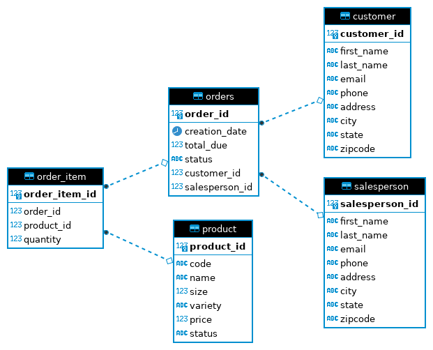

# Introduction
This application uses JDBC to make a connection to the PostgreSQL database server through a Java program,
which allows the user to perform CRUD (create, read, update, and delete) operations on the data. The Data Access Object
(DAO) pattern is used as a simple abstraction layer and implements two data transfer objects (DTO) for Customers
and Orders. The technologies used to build this application are Docker, Maven, JDBC, PostgreSQL, and IntelliJ. 

# Implementation
## ER Diagram
The entity-relationship diagram for all tables within the hplussport database is shown below.



## Design Patterns
The __Data Access Pattern (DAO)__ is one of the most common patterns when dealing with databases. It
generally supports multiple tables and provides an abstraction layer between the raw JDBC code and the code in the application.

The __Repository pattern__ only focuses on a single table access per class rather than accessing the entire database
as a whole. This allows the user to shard the database and simply retrieve a fragment of the requested data from the database. It is also
ideal for applications that are horizontally scalable.

# Test
This application was tested manually by first executing the command ```psql -h localhost -U postgres -d hplussport```
to login to the database and ensure that it is running. The ```JDBCExecutor``` establishes a connection to the 
database, returns the DTO obtained from the CustomerDAO and OrderDAO and displays the result.

```
# Sample output
Order{id=1000, customerFirstName='Angela', customerLastLane='Crawford', customerEmail='acrawford8p@com.com', creationDate=Sat May 14 00:00:00 UTC 2016, totalDue=118.22, status='paid', salespersonFirstName='Edward', salespersonLastName='Kelley', salespersonEmail='ekelleyu@hplussport.com', orderLines=[OrderLine{quantity=31, productCode='MWCRA20', productName='Mineral Water', productSize=20, productVariety='Cranberry', productPrice=1.79}, OrderLine{quantity=17, productCode='MWLEM32', productName='Mineral Water', productSize=32, productVariety='Lemon-Lime', productPrice=3.69}]}
```